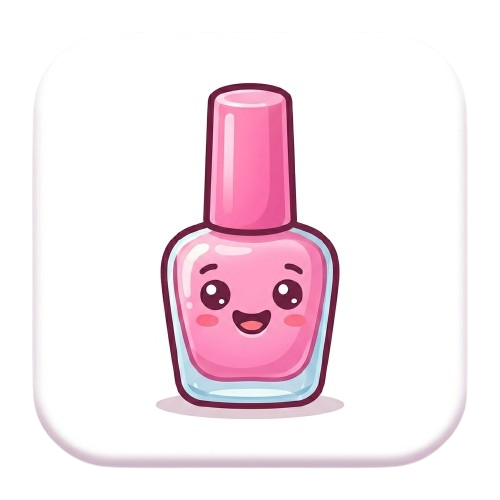

#  Salão das Sílabas

**Salão das Sílabas** é um jogo educacional focado na alfabetização infantil lúdica. O projeto utiliza uma temática divertida de salão de beleza para ensinar o reconhecimento e a combinação de sílabas na formação de palavras.

---

## 🎯 Objetivo Pedagógico

O jogo foi desenvolvido com foco no **Método ABACADA**, que associa três elementos fundamentais: **Imagem, Sílaba e Palavra**.

*   **Público-alvo:** Crianças em fase de alfabetização.
*   **Inclusividade:** Design e mecânicas adaptadas para crianças com necessidades educacionais especiais, garantindo um ritmo de aprendizagem acolhedor.
*   **Foco:** Desenvolvimento da consciência fonológica e habilidades iniciais de leitura.

## 💅 Mecânicas do Jogo

O elemento central é uma **mão com cinco dedos**, onde cada unha contém uma sílaba.

1.  **Desafio:** Uma imagem é exibida com sua palavra incompleta (ex: "GA - ___").
2.  **Interação:** O jogador deve identificar a sílaba correta entre os cinco "esmaltes" (unhas) e clicar para "pintar a unha".
3.  **Feedback:** 
    *   **Acerto:** A unha ganha cor vibrante, brilhos e feedback sonoro alegre com narração da palavra.
    *   **Erro:** Feedback suave e encorajador (sem punição visual), incentivando a criança a tentar novamente.

## 🚀 Tecnologias Utilizadas

*   **Engine:** [Godot Engine 4.x](https://godotengine.org/)
*   **Linguagem:** GDScript
*   **Áudio:** Vozes geradas via **ElevenLabs** para garantir clareza fonética.
*   **Design:** Estética colorida, vibrante e amigável.

## 🛠️ Como Executar

1.  Baixe e instale o [Godot Engine](https://godotengine.org/download).
2.  Clone este repositório.
3.  Abra o Godot e importe o arquivo `project.godot`.
4.  Pressione `F5` para iniciar o jogo a partir da cena de introdução.

---

*Desenvolvido com ❤️ para transformar a alfabetização em uma experiência mágica.*
